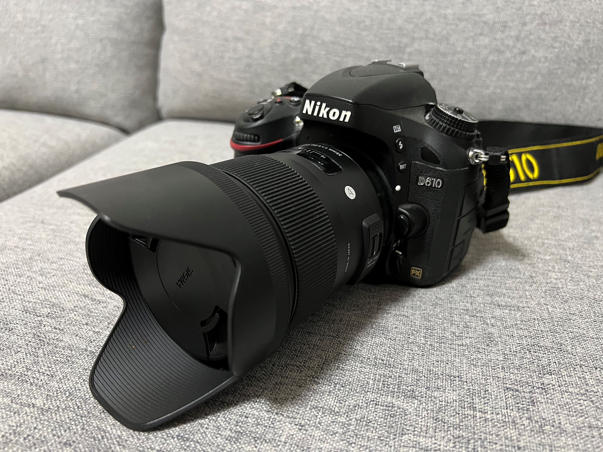
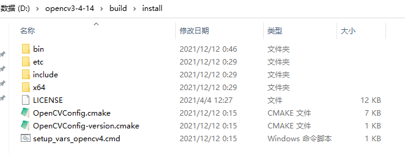

# YQ-ISP
-------
tiny ISP simulation

相机是NIKON D610，镜头有两个sigma 35 F1.4和NIKON 85 F1.8，考虑到FOV和shading，畸变存在的多少，后续只使用sigma 35 F1.4拍摄NEF，转换到DNG后做仿真；



**环境**：
>版本	Windows 10 专业版 <br>
>版本号	21H2<br>
>安装日期   2020/11/14<br>
>操作系统内部版本	19044.1586<br>
>体验	Windows Feature Experience Pack 120.2212.4170.0<br>
>设备名称	DESKTOP-6ORRKMN<br>
>处理器	Intel(R) Core(TM) i3-8100 CPU @ 3.60GHz   3.60 GHz<br>
>机带 RAM	16.0 GB<br>
>设备 ID	xxxxx-xxxx-xxxx-A642-C4EC5ADB8789<br>
>产品 ID	xxxxx-80000-00000-xxxxx<br>
>系统类型	64 位操作系统, 基于 x64 的处理器<br>
>笔和触控	没有可用于此显示器的笔或触控输入<br>

**依赖**：<br>
第三方库用到了dng_sdk, libjpeg, libxml2，均放置在thirdparty目录下，包含vs2019 v142和gcc9.3.0预编译二进制lib；

此外还有OpenCV，这部分需要自行配置，使得cmake可以检测到；
新建环境变量`OPENCV_DIR`，指向你的opencv安装目录，比如：


## 规划
- [x] DNG/RAW支持

- [x] ubuntu/windows跨平台支持

- [x] cmake支持

- [ ] opencl加速耗时模块

- [ ] 多stripe支持


## 使用方法
采用cmake进行跨平台构建，已在VS2019 c++工具集v142，ubuntu20.04 gcc 9.3.0下测试通过;
windows生成VS工程方法：
```bat
cd build
./generate_vs2019sln.bat
```
打开.sln文件使用vs编译, 设置isp_emulation为启动项目;
vs设置启动参数：

>-p [pipe_number] -cfg [xml_file] -f [frame_end]


ubuntu生成makefile并编译:
```sh
cd build
./generate_makefile.sh
```
ubuntu上编译运行依赖libz, liblzma
```sh
sudo apt-get install libz-dev liblzma-dev
```
运行示例：
```sh
$> ./isp_emulation -p 0 -cfg ../cfg/V1_config.xml -f 0 2
[2022-03-27 17:42:32:979] D:\yqzeng\github_repo\YQ-ISP\bin\Release\isp_emulation.exe -p 0 -cfg ../cfg/V1_config.xml -f 2 
[2022-03-27 17:42:32:979] raw_in init run start
[2022-03-27 17:42:32:979] raw_in init run end
[2022-03-27 17:42:32:979] fe_fw init run start
[2022-03-27 17:42:32:979] fe_fw init run end
[2022-03-27 17:42:32:979] sensor_crop_hw init run start
[2022-03-27 17:42:32:979] sensor_crop_hw init run end
[2022-03-27 17:42:32:979] blc_hw init run start
[2022-03-27 17:42:32:979] blc_hw init run end
[2022-03-27 17:42:32:979] lsc_hw init run start
[2022-03-27 17:42:32:979] lsc_hw init run end
[2022-03-27 17:42:32:979] ae_stat_hw init run start
[2022-03-27 17:42:32:979] ae_stat_hw init run end
[2022-03-27 17:42:32:979] awbgain_hw init run start
[2022-03-27 17:42:32:979] awbgain_hw init run end
[2022-03-27 17:42:32:979] demosaic_hw init run start
[2022-03-27 17:42:32:979] demosaic_hw init run end
[2022-03-27 17:42:32:979] cc_hw init run start
[2022-03-27 17:42:32:979] cc_hw init run end
[2022-03-27 17:42:32:979] gtm_stat_hw init run start
[2022-03-27 17:42:32:979] gtm_stat_hw init run end
[2022-03-27 17:42:32:979] gtm_hw init run start
[2022-03-27 17:42:32:979] gtm_hw init run end
[2022-03-27 17:42:32:979] gamma_hw init run start
[2022-03-27 17:42:32:979] gamma_hw init run end
[2022-03-27 17:42:32:979] rgb2yuv_hw init run start
[2022-03-27 17:42:32:979] rgb2yuv_hw init run end
[2022-03-27 17:42:32:979] yuv422_conv_hw init run start
[2022-03-27 17:42:32:979] yuv422_conv_hw init run end
[2022-03-27 17:42:32:979] yuv_encode_hw init run start
[2022-03-27 17:42:32:979] yuv_encode_hw init run end
[2022-03-27 17:42:32:985] root node name: pipeline_config, type:1
[2022-03-27 17:42:32:985] component name component, type:1
[2022-03-27 17:42:32:985] tag name:inst_name text:raw_in
[2022-03-27 17:42:32:985] tag name:bayer_type text:RGGB
[2022-03-27 17:42:32:985] tag name:bit_depth text:14
[2022-03-27 17:42:32:985] tag name:file_type text:DNG
[2022-03-27 17:42:32:985] tag name:file_name text:../raw_image/_ATM8636.dng
[2022-03-27 17:42:32:985] tag name:img_width text:6034
[2022-03-27 17:42:32:985] tag name:img_height text:4028
[2022-03-27 17:42:32:985] component name component, type:1
[2022-03-27 17:42:32:985] tag name:inst_name text:sensor_crop_hw
[2022-03-27 17:42:32:985] tag name:bypass text:0
[2022-03-27 17:42:32:985] tag name:xmlConfigValid text:0
[2022-03-27 17:42:32:985] tag name:write_pic text:0
[2022-03-27 17:42:32:985] tag name:write_pic_src_pin text:0
[2022-03-27 17:42:32:985] tag name:write_pic_format text:RAW
[2022-03-27 17:42:32:986] tag name:write_pic_path text:./_sensor_crop_dump.raw
[2022-03-27 17:42:32:986] tag name:write_pic_bits text:8
[2022-03-27 17:42:32:986] component name component, type:1
[2022-03-27 17:42:32:986] tag name:inst_name text:blc_hw
[2022-03-27 17:42:32:986] tag name:bypass text:0
[2022-03-27 17:42:32:986] tag name:xmlConfigValid text:0
[2022-03-27 17:42:32:986] tag name:write_pic text:0
[2022-03-27 17:42:32:986] tag name:write_pic_src_pin text:0
[2022-03-27 17:42:32:986] tag name:write_pic_format text:RAW
[2022-03-27 17:42:32:986] tag name:write_pic_path text:./_blc_dump.raw
[2022-03-27 17:42:32:986] tag name:write_pic_bits text:8
[2022-03-27 17:42:32:986] component name component, type:1
[2022-03-27 17:42:32:986] tag name:inst_name text:lsc_hw
[2022-03-27 17:42:32:986] tag name:bypass text:0
[2022-03-27 17:42:32:986] tag name:xmlConfigValid text:0
[2022-03-27 17:42:32:986] tag name:write_pic text:0
[2022-03-27 17:42:32:986] tag name:write_pic_src_pin text:0
[2022-03-27 17:42:32:986] tag name:write_pic_format text:RAW
[2022-03-27 17:42:32:986] tag name:write_pic_path text:./_lsc_dump.raw
[2022-03-27 17:42:32:986] tag name:write_pic_bits text:14
[2022-03-27 17:42:32:986] component name component, type:1
[2022-03-27 17:42:32:986] tag name:inst_name text:ae_stat_hw
[2022-03-27 17:42:32:986] tag name:bypass text:0
[2022-03-27 17:42:32:986] tag name:xmlConfigValid text:0
[2022-03-27 17:42:32:986] tag name:write_pic text:0
[2022-03-27 17:42:32:986] tag name:write_pic_src_pin text:0
[2022-03-27 17:42:32:987] tag name:write_pic_format text:RAW
[2022-03-27 17:42:32:987] tag name:write_pic_path text:./_ae_stat_dump.raw
[2022-03-27 17:42:32:987] tag name:write_pic_bits text:16
[2022-03-27 17:42:32:987] component name component, type:1
[2022-03-27 17:42:32:987] tag name:inst_name text:awbgain_hw
[2022-03-27 17:42:32:987] tag name:bypass text:0
[2022-03-27 17:42:32:987] tag name:xmlConfigValid text:0
[2022-03-27 17:42:32:987] tag name:write_pic text:0
[2022-03-27 17:42:32:987] tag name:write_pic_src_pin text:0
[2022-03-27 17:42:32:987] tag name:write_pic_format text:RAW
[2022-03-27 17:42:32:987] tag name:write_pic_path text:./_awb_dump.raw
[2022-03-27 17:42:32:987] tag name:write_pic_bits text:8
[2022-03-27 17:42:32:987] component name component, type:1
[2022-03-27 17:42:32:987] tag name:inst_name text:demosaic_hw
[2022-03-27 17:42:32:987] tag name:bypass text:0
[2022-03-27 17:42:32:987] tag name:xmlConfigValid text:0
[2022-03-27 17:42:32:987] tag name:write_pic text:0
[2022-03-27 17:42:32:987] tag name:write_pic_src_pin text:0,1,2
[2022-03-27 17:42:32:987] tag name:write_pic_format text:PNM
[2022-03-27 17:42:32:987] tag name:write_pic_path text:./_demosaic_dump.pnm
[2022-03-27 17:42:32:987] tag name:write_pic_bits text:8
[2022-03-27 17:42:32:987] component name component, type:1
[2022-03-27 17:42:32:987] tag name:inst_name text:cc_hw
[2022-03-27 17:42:32:987] tag name:bypass text:0
[2022-03-27 17:42:32:987] tag name:xmlConfigValid text:0
[2022-03-27 17:42:32:987] tag name:write_pic text:0
[2022-03-27 17:42:32:987] tag name:write_pic_src_pin text:0,1,2
[2022-03-27 17:42:32:987] tag name:write_pic_format text:PNM
[2022-03-27 17:42:32:987] tag name:write_pic_path text:./_cc_dump.pnm
[2022-03-27 17:42:32:987] tag name:write_pic_bits text:8
[2022-03-27 17:42:32:987] component name component, type:1
[2022-03-27 17:42:32:987] tag name:inst_name text:gtm_stat_hw
[2022-03-27 17:42:32:987] tag name:bypass text:0
[2022-03-27 17:42:32:987] tag name:xmlConfigValid text:0
[2022-03-27 17:42:32:987] tag name:write_pic text:0
[2022-03-27 17:42:32:987] tag name:write_pic_src_pin text:0
[2022-03-27 17:42:32:987] tag name:write_pic_format text:RAW
[2022-03-27 17:42:32:987] tag name:write_pic_path text:./_gtm_stat_dump.raw
[2022-03-27 17:42:32:987] tag name:write_pic_bits text:16
[2022-03-27 17:42:32:987] component name component, type:1
[2022-03-27 17:42:32:987] tag name:inst_name text:gtm_hw
[2022-03-27 17:42:32:987] tag name:bypass text:0
[2022-03-27 17:42:32:987] tag name:xmlConfigValid text:0
[2022-03-27 17:42:32:987] tag name:write_pic text:0
[2022-03-27 17:42:32:987] tag name:write_pic_src_pin text:0,1,2
[2022-03-27 17:42:32:987] tag name:write_pic_format text:PNM
[2022-03-27 17:42:32:987] tag name:write_pic_path text:./_gtm_dump.pnm
[2022-03-27 17:42:32:987] tag name:write_pic_bits text:8
[2022-03-27 17:42:32:987] component name component, type:1
[2022-03-27 17:42:32:987] tag name:inst_name text:gamma_hw
[2022-03-27 17:42:32:987] tag name:bypass text:0
[2022-03-27 17:42:32:987] tag name:xmlConfigValid text:0
[2022-03-27 17:42:32:987] tag name:write_pic text:1
[2022-03-27 17:42:32:987] tag name:write_pic_src_pin text:0,1,2
[2022-03-27 17:42:32:987] tag name:write_pic_format text:PNM
[2022-03-27 17:42:32:987] tag name:write_pic_path text:./_gamma_dump.pnm
[2022-03-27 17:42:32:987] tag name:write_pic_bits text:8
[2022-03-27 17:42:32:987] component name component, type:1
[2022-03-27 17:42:32:987] tag name:inst_name text:rgb2yuv_hw
[2022-03-27 17:42:32:987] tag name:bypass text:0
[2022-03-27 17:42:32:987] tag name:xmlConfigValid text:0
[2022-03-27 17:42:32:987] tag name:write_pic text:0
[2022-03-27 17:42:32:987] tag name:write_pic_src_pin text:0,1,2
[2022-03-27 17:42:32:987] tag name:write_pic_format text:YUV444
[2022-03-27 17:42:32:987] tag name:write_pic_path text:./_rgb2yuv_dump.yuv
[2022-03-27 17:42:32:987] tag name:write_pic_bits text:8
[2022-03-27 17:42:32:987] component name component, type:1
[2022-03-27 17:42:32:987] tag name:inst_name text:yuv422_conv_hw
[2022-03-27 17:42:32:987] tag name:byp ass text:0
[2022-03-27 17:42:32:987] tag name:xmlConfigValid text:0
[2022-03-27 17:42:32:987] tag name:write_pic text:0
[2022-03-27 17:42:32:987] tag name:write_pic_src_pin text:0,1,2
[2022-03-27 17:42:32:987] tag name:write_pic_format text:YUV422
[2022-03-27 17:42:32:987] tag name:write_pic_path text:./_yuv422conv_dump.yuv
[2022-03-27 17:42:32:987] tag name:write_pic_bits text:8
[2022-03-27 17:42:32:987] component name component, type:1
[2022-03-27 17:42:32:987] tag name:inst_name text:yuv_encode_hw
[2022-03-27 17:42:32:987] tag name:bypass text:0
[2022-03-27 17:42:32:987] tag name:use_input_file_name text:1
[2022-03-27 17:42:32:987] tag name:output_jpg_file_name text:./V1_pipeline_out.jpg
[2022-03-27 17:42:32:987] run module raw_in
[2022-03-27 17:42:32:987] fileRead::hw_run run start frame 0
[2022-03-27 17:42:33:361] bayer: 0 0:RGGB 1:GRBG 2:GBRG 3:BGGR
[2022-03-27 17:42:33:361] total size 6034, 4028
[2022-03-27 17:42:33:361] alloc buffer raw_in out0 memory 000001A01F496040
[2022-03-27 17:42:33:369] active region 0, 0, 6034, 4028
[2022-03-27 17:42:33:369] black level repeat dim 1, 1, 1 value:
[2022-03-27 17:42:33:369] 0.000000, 0.000000, 0.000000, 0.000000
[2022-03-27 17:42:33:369] 0.000000, 0.000000, 0.000000, 0.000000
[2022-03-27 17:42:33:369] 0.000000, 0.000000, 0.000000, 0.000000
[2022-03-27 17:42:33:369] 0.000000, 0.000000, 0.000000, 0.000000
[2022-03-27 17:42:33:369] 0.000000, 0.000000, 0.000000, 0.000000
[2022-03-27 17:42:33:369] 0.000000, 0.000000, 0.000000, 0.000000
[2022-03-27 17:42:33:369] 0.000000, 0.000000, 0.000000, 0.000000
[2022-03-27 17:42:33:369] 0.000000, 0.000000, 0.000000, 0.000000
[2022-03-27 17:42:33:369] 0.000000, 0.000000, 0.000000, 0.000000
[2022-03-27 17:42:33:369] 0.000000, 0.000000, 0.000000, 0.000000
[2022-03-27 17:42:33:369] 0.000000, 0.000000, 0.000000, 0.000000
[2022-03-27 17:42:33:369] 0.000000, 0.000000, 0.000000, 0.000000
[2022-03-27 17:42:33:370] 0.000000, 0.000000, 0.000000, 0.000000
[2022-03-27 17:42:33:370] 0.000000, 0.000000, 0.000000, 0.000000
[2022-03-27 17:42:33:370] 0.000000, 0.000000, 0.000000, 0.000000
[2022-03-27 17:42:33:370] 0.000000, 0.000000, 0.000000, 0.000000
[2022-03-27 17:42:33:370] 0.000000, 0.000000, 0.000000, 0.000000
[2022-03-27 17:42:33:370] 0.000000, 0.000000, 0.000000, 0.000000
[2022-03-27 17:42:33:370] 0.000000, 0.000000, 0.000000, 0.000000
[2022-03-27 17:42:33:370] 0.000000, 0.000000, 0.000000, 0.000000
[2022-03-27 17:42:33:370] 0.000000, 0.000000, 0.000000, 0.000000
[2022-03-27 17:42:33:370] 0.000000, 0.000000, 0.000000, 0.000000
[2022-03-27 17:42:33:370] 0.000000, 0.000000, 0.000000, 0.000000
[2022-03-27 17:42:33:370] 0.000000, 0.000000, 0.000000, 0.000000
[2022-03-27 17:42:33:370] 0.000000, 0.000000, 0.000000, 0.000000
[2022-03-27 17:42:33:370] 0.000000, 0.000000, 0.000000, 0.000000
[2022-03-27 17:42:33:370] 0.000000, 0.000000, 0.000000, 0.000000
[2022-03-27 17:42:33:370] 0.000000, 0.000000, 0.000000, 0.000000
[2022-03-27 17:42:33:370] 0.000000, 0.000000, 0.000000, 0.000000
[2022-03-27 17:42:33:370] 0.000000, 0.000000, 0.000000, 0.000000
[2022-03-27 17:42:33:370] 0.000000, 0.000000, 0.000000, 0.000000
[2022-03-27 17:42:33:370] 0.000000, 0.000000, 0.000000, 0.000000
[2022-03-27 17:42:33:370] 0.000000, 0.000000, 0.000000, 0.000000
[2022-03-27 17:42:33:370] 0.000000, 0.000000, 0.000000, 0.000000
[2022-03-27 17:42:33:370] 0.000000, 0.000000, 0.000000, 0.000000
[2022-03-27 17:42:33:370] 0.000000, 0.000000, 0.000000, 0.000000
[2022-03-27 17:42:33:370] 0.000000, 0.000000, 0.000000, 0.000000
[2022-03-27 17:42:33:370] 0.000000, 0.000000, 0.000000, 0.000000
[2022-03-27 17:42:33:370] 0.000000, 0.000000, 0.000000, 0.000000
[2022-03-27 17:42:33:370] 0.000000, 0.000000, 0.000000, 0.000000
[2022-03-27 17:42:33:370] 0.000000, 0.000000, 0.000000, 0.000000
[2022-03-27 17:42:33:370] 0.000000, 0.000000, 0.000000, 0.000000
[2022-03-27 17:42:33:370] 0.000000, 0.000000, 0.000000, 0.000000
[2022-03-27 17:42:33:370] 0.000000, 0.000000, 0.000000, 0.000000
[2022-03-27 17:42:33:370] 0.000000, 0.000000, 0.000000, 0.000000
[2022-03-27 17:42:33:370] 0.000000, 0.000000, 0.000000, 0.000000
[2022-03-27 17:42:33:370] 0.000000, 0.000000, 0.000000, 0.000000
[2022-03-27 17:42:33:370] 0.000000, 0.000000, 0.000000, 0.000000
[2022-03-27 17:42:33:370] 0.000000, 0.000000, 0.000000, 0.000000
[2022-03-27 17:42:33:370] 0.000000, 0.000000, 0.000000, 0.000000
[2022-03-27 17:42:33:370] 0.000000, 0.000000, 0.000000, 0.000000
[2022-03-27 17:42:33:370] 0.000000, 0.000000, 0.000000, 0.000000
[2022-03-27 17:42:33:370] 0.000000, 0.000000, 0.000000, 0.000000
[2022-03-27 17:42:33:370] 0.000000, 0.000000, 0.000000, 0.000000
[2022-03-27 17:42:33:370] 0.000000, 0.000000, 0.000000, 0.000000
[2022-03-27 17:42:33:370] 0.000000, 0.000000, 0.000000, 0.000000
[2022-03-27 17:42:33:370] 0.000000, 0.000000, 0.000000, 0.000000
[2022-03-27 17:42:33:370] 0.000000, 0.000000, 0.000000, 0.000000
[2022-03-27 17:42:33:370] 0.000000, 0.000000, 0.000000, 0.000000
[2022-03-27 17:42:33:370] 0.000000, 0.000000, 0.000000, 0.000000
[2022-03-27 17:42:33:370] 0.000000, 0.000000, 0.000000, 0.000000
[2022-03-27 17:42:33:370] 0.000000, 0.000000, 0.000000, 0.000000
[2022-03-27 17:42:33:370] 0.000000, 0.000000, 0.000000, 0.000000
[2022-03-27 17:42:33:370] 0.000000, 0.000000, 0.000000, 0.000000
[2022-03-27 17:42:33:370] bit depth is 14 white_level = 15520.000000, 65535.000000, 65535.000000, 65535.000000
[2022-03-27 17:42:33:370] ae info: apertureValue F 1/2.643856, ISO 200 0 0, ExposureTime 0.002500 s, BV 5.4491
[2022-03-27 17:42:33:370] baseline exposure = 0.350000
[2022-03-27 17:42:33:370] lsc info: FocalLength 85.000000 mm, FocalPlaneResolutionUnit 3 1:none, 2:inch, 3:cm, 4:mm, 5:microm
[2022-03-27 17:42:33:370] FocalPlaneXResolution 1675.014984,         FocalPlaneYResolution 1675.014984, FocusDistance 3.350000 m
[2022-03-27 17:42:33:370] tone curve:
[2022-03-27 17:42:33:417] fileRead::hw_run run end frame 0
[2022-03-27 17:42:33:417] run module fe_fw
[2022-03-27 17:42:33:417] fe_firmware::hw_run run start
[2022-03-27 17:42:33:417] alloc buffer fe_fw_out0 memory 000001A01C61C040
[2022-03-27 17:42:33:427] alloc buffer fe_fw_out1 memory 000001A01C3C0A30
[2022-03-27 17:42:33:427] apertureVal input 2.643856 apertureVal0 2.000000 apertureVal1 2.970854
[2022-03-27 17:42:33:427] total_step 0.163396 part_step0 0.041632
[2022-03-27 17:42:33:427] focusDist 3.350000 focusElement[0].focusDist 0.300000 focusElement[5].focusDist 999999995904.000000
[2022-03-27 17:42:33:427] w1 1.000000 w2 0.000000
[2022-03-27 17:42:33:427] focusDist 3.350000 focusElement[0].focusDist 0.300000 focusElement[5].focusDist 999999995904.000000
[2022-03-27 17:42:33:427] w1 1.000000 w2 0.000000
[2022-03-27 17:42:33:427] weight0 1.000000 weight1 0.000000 weight2 1.000000 weight3 0.000000
[2022-03-27 17:42:33:427] weight0 0.254791 weight1 0.745209
[2022-03-27 17:42:33:427] weight0 0.254791 weight1 0.000000 weight2 0.745209 weight3 0.000000
[2022-03-27 17:42:33:427] compensat_gain 1.274561
................................................
[2022-03-27 17:42:39:881] fileRead::~fileRead deinit start
[2022-03-27 17:42:39:881] fileRead::~fileRead deinit end
[2022-03-27 17:42:39:881] deinit module raw_in
[2022-03-27 17:42:39:881] fe_firmware::~fe_firmware module fe_fw deinit start
[2022-03-27 17:42:39:881] fe_firmware::~fe_firmware module fe_fw deinit end
[2022-03-27 17:42:39:881] deinit module fe_fw
[2022-03-27 17:42:39:881] sensor_crop::~sensor_crop module deinit start
[2022-03-27 17:42:39:881] sensor_crop::~sensor_crop module deinit end
[2022-03-27 17:42:39:881] deinit module sensor_crop_hw
[2022-03-27 17:42:39:881] blc::~blc module deinit start
[2022-03-27 17:42:39:881] blc::~blc module deinit end
[2022-03-27 17:42:39:881] deinit module blc_hw
[2022-03-27 17:42:39:881] lsc::~lsc module deinit start
[2022-03-27 17:42:39:881] lsc::~lsc module deinit end
[2022-03-27 17:42:39:881] deinit module lsc_hw
[2022-03-27 17:42:39:881] ae_stat::~ae_stat module deinit start
[2022-03-27 17:42:39:881] ae_stat::~ae_stat module deinit end
[2022-03-27 17:42:39:881] deinit module ae_stat_hw
[2022-03-27 17:42:39:881] awbgain::~awbgain module deinit start
[2022-03-27 17:42:39:881] awbgain::~awbgain module deinit end
[2022-03-27 17:42:39:881] deinit module awbgain_hw
[2022-03-27 17:42:39:881] demosaic::~demosaic module deinit start
[2022-03-27 17:42:39:881] demosaic::~demosaic module deinit end
[2022-03-27 17:42:39:881] deinit module demosaic_hw
[2022-03-27 17:42:39:881] cc::~cc module deinit start
[2022-03-27 17:42:39:881] cc::~cc module deinit end
[2022-03-27 17:42:39:881] deinit module cc_hw
[2022-03-27 17:42:39:881] gtm_stat::~gtm_stat module deinit start
[2022-03-27 17:42:39:881] gtm_stat::~gtm_stat module deinit end
[2022-03-27 17:42:39:881] deinit module gtm_stat_hw
[2022-03-27 17:42:39:881] gtm::~gtm module deinit start
[2022-03-27 17:42:39:881] gtm::~gtm module deinit end
[2022-03-27 17:42:39:881] deinit module gtm_hw
[2022-03-27 17:42:39:881] Gamma::~Gamma module deinit start
[2022-03-27 17:42:39:881] Gamma::~Gamma module deinit end
[2022-03-27 17:42:39:881] deinit module gamma_hw
[2022-03-27 17:42:39:881] rgb2yuv::~rgb2yuv module deinit start
[2022-03-27 17:42:39:882] rgb2yuv::~rgb2yuv module deinit end
[2022-03-27 17:42:39:882] deinit module rgb2yuv_hw
[2022-03-27 17:42:39:882] yuv422_conv::~yuv422_conv module deinit start
[2022-03-27 17:42:39:882] yuv422_conv::~yuv422_conv module deinit end
[2022-03-27 17:42:39:882] deinit module yuv422_conv_hw
[2022-03-27 17:42:39:882] yuv_encode::~yuv_encode module deinit start
[2022-03-27 17:42:39:882] yuv_encode::~yuv_encode module deinit end
[2022-03-27 17:42:39:882] deinit module yuv_encode_hw
```

## 镜头的vignette校正参数
首先是没有均匀灯箱，所以不可能自己测试各个光圈下的vignette，只能采用别人已经测量好的参数，adobe的lcp（lens correction profile)是文本方式（确切的说是xml格式），只要安装以下任意一个软件都可以获得：

1. photoshop -- 收费
2. lightroom -- 收费
3. Adobe DNG Converter -- 免费
   
存放lens profiles的路径：
```sh
C:\ProgramData\Adobe\CameraRaw\LensProfiles\1.0\Sigma\Nikon #我的是nikon相机配sigma镜头
```
内容节选：
```xml
<rdf:li>
 <rdf:Description
  stCamera:FocalLength="35"
  stCamera:FocusDistance="999999995904"
  stCamera:ApertureValue="0.970854">
 <stCamera:PerspectiveModel>
  <stCamera:VignetteModel>
   <rdf:Description
    stCamera:ResidualMeanError="0.021197"
    stCamera:VignetteModelParam1="-5.668678"
    stCamera:VignetteModelParam2="19.64465"
    stCamera:VignetteModelParam3="-28.093815">
   <stCamera:VignetteModelPiecewiseParam>
    <rdf:Seq>
     <rdf:li>0.000000, 1.000000</rdf:li>
     <rdf:li>0.133789, 0.858700</rdf:li>
     <rdf:li>0.273387, 0.678600</rdf:li>
     <rdf:li>0.570885, 0.257700</rdf:li>
     <rdf:li>0.610752, 0.206000</rdf:li>
    </rdf:Seq>
   </stCamera:VignetteModelPiecewiseParam>
   </rdf:Description>
  </stCamera:VignetteModel>
  </rdf:Description>
 </stCamera:PerspectiveModel>
 </rdf:Description>
</rdf:li>
```

abobe的vignette model:


~~如果没有安装ps或者lr，则参考如下第三方结果：~~

~~https://github.com/lensfun/lensfun/blob/master/data/db/slr-sigma.xml~~
~~里面列举了部分镜头的畸变和vignette参数，比如sigma 35 F1.4:~~
~~同时还提供了lcp转换工具：https://lensfun.github.io/manual/latest/lensfun-convert-lcp.html~~
