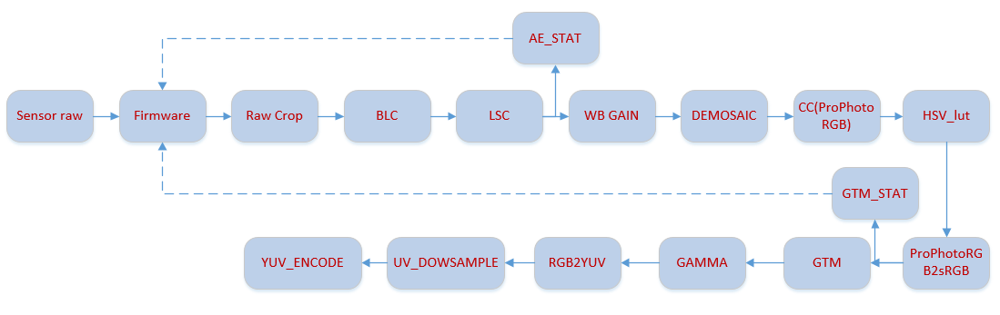

# ISP仿真工程使用说明
----
## 环境配置
支持双编译平台:
- [x] Win10 MSVC 142
- [x] Linux GCC 9.3.0

windows下的环境需求：
1. cmake， [下载链接](https://cmake.org/download/)，安装时选择添加路径到系统环境变量；
2. ms build tools & win10 sdk， 下载visual studio installer，选择单个组件安装：


## 编译运行
首先生成vs工程，
```bat
cd build
.\generate_vs2019sln.bat
```
编译release版本：
```bat
cmake --build . --config=Release
```
编译deubg版本：
```bat
cmake --build . --config=Debug
```
运行demo：
```bat
.\run_release.bat
```
结束后会在build目录下生成一张jpg。

## pipeline组织
开发框架的3个特点：
1. 算法模块化，算法开发人员如需增加模块，只需要按照模板新增代码文件，在pipeline中插入即可；
2. 软硬件代码分离，脱离软件部分也可以运行硬件代码，便于单独验证硬件代码；
3. pipeline组织自由，开发人员可自定义pipeline，接入所需的算法模块自由测试；

举例来说，如下是一个简单的ISP处理流程：


其对应的pipeline组织代码：
```C++
    fileRead* raw_in = new fileRead(1, "raw_in");
    fw_manager* fe_fw_manager = new fw_manager(1, 2, "fe_fw_manager");
    raw_crop_hw* raw_crop_hw_inst = new raw_crop_hw(2, 1, "raw_crop_hw");
    raw_crop_fw* raw_crop_fw_inst = new raw_crop_fw(1, 1, "raw_crop_fw");
    blc_hw* blc_hw_inst = new blc_hw(2, 1, "blc_hw"); 
    //两个输入，一个输出，输入raw和寄存器，输出raw
    blc_fw* blc_fw_inst = new blc_fw(1, 1, "blc_fw");
    lsc_hw* lsc_hw_inst = new lsc_hw(2, 1, "lsc_hw"); 
    //两个输入，一个输出，输入raw和寄存器，输出raw
    lsc_fw* lsc_fw_inst = new lsc_fw(1, 1, "lsc_fw");
    ae_stat_hw* ae_stat_hw_inst = new ae_stat_hw(2, 0, "ae_stat_hw");
    //两个输入，没有输出，输入raw和寄存器，输出统计到fw
    ae_stat_fw* ae_stat_fw_inst = new ae_stat_fw(1, 1, "ae_stat_fw");
    awbgain_hw* awbgain_hw_inst = new awbgain_hw(2, 1, "awbgain_hw");
    awbgain_fw* awbgain_fw_inst = new awbgain_fw(1, 1, "awbgain_fw");
    demosaic_hw* demosaic_hw_inst = new demosaic_hw(2, 3, "demosaic_hw");
    demosaic_fw* demosaic_fw_inst = new demosaic_fw(1, 1, "demosaic_fw");
    cc_hw* cc_hw_inst = new cc_hw(4, 3, "cc_hw"); //4个输入, r g b和寄存器, 3个输出r g b
    cc_fw* cc_fw_inst = new cc_fw(1, 1, "cc_fw");
    hsv_lut_hw* hsv_lut_hw_inst = new hsv_lut_hw(4, 3, "hsv_lut_hw");
    hsv_lut_fw* hsv_lut_fw_inst = new hsv_lut_fw(1, 1, "hsv_lut_fw");
    prophoto2srgb_hw* prophoto2srgb_hw_inst = new prophoto2srgb_hw(4, 3, "prophoto2srgb_hw");
    prophoto2srgb_fw* prophoto2srgb_fw_inst = new prophoto2srgb_fw(1, 1, "prophoto2srgb_fw");
    gtm_stat_hw* gtm_stat_hw_inst = new gtm_stat_hw(4, 1, "gtm_stat_hw");
    gtm_stat_fw* gtm_stat_fw_inst = new gtm_stat_fw(1, 1, "gtm_stat_fw");
    gtm_hw* gtm_hw_inst = new gtm_hw(4, 3, "gtm_hw");
    gtm_fw* gtm_fw_inst = new gtm_fw(1, 1, "gtm_fw");
    Gamma_hw* gamma_hw_inst = new Gamma_hw(4, 3, "gamma_hw");
    Gamma_fw* gamma_fw_inst = new Gamma_fw(1, 1, "gamma_fw");
    rgb2yuv_hw* rgb2yuv_hw_inst = new rgb2yuv_hw(4, 3, "rgb2yuv_hw");
    rgb2yuv_fw* rgb2yuv_fw_inst = new rgb2yuv_fw(1, 1, "rgb2yuv_fw");
    yuv422_conv_hw* yuv422_conv_hw_inst = new yuv422_conv_hw(4, 3, "yuv422_conv_hw");
    yuv422_conv_fw* yuv422_conv_fw_inst = new yuv422_conv_fw(1, 1, "yuv422_conv_fw");
    yuv_encode_hw* yuv_encode_hw_inst = new yuv_encode_hw(3, 0, "yuv_encode_hw");
```
首先创建所有所需的算法软硬件模块，指定各模块输入输出的pin脚数量，以及实例名称ID(用于XML配置匹配)。
接下来进行硬件模块注册：
```C++
    manager->register_hw_module(raw_in);
    ......
    manager->register_hw_module(yuv_encode_hw_inst);
```
硬件模块连接，约定输入最后一个pin为寄存器输入：
```C++
    manager->connect_port(raw_in, 0, fe_fw_manager, 0); //raw data
    manager->connect_port(fe_fw_manager, 0, raw_crop_hw_inst, 0); //raw data
    manager->connect_port(fe_fw_manager, 1, raw_crop_hw_inst, 1);  //regs
    ......
    ......
    manager->connect_port(rgb2yuv_hw_inst, 0, yuv422_conv_hw_inst, 0); //y
    manager->connect_port(rgb2yuv_hw_inst, 1, yuv422_conv_hw_inst, 1); //u
    manager->connect_port(rgb2yuv_hw_inst, 2, yuv422_conv_hw_inst, 2); //v
    manager->connect_port(fe_fw_manager, 1, yuv422_conv_hw_inst, 3); //regs

    manager->connect_port(yuv422_conv_hw_inst, 0, yuv_encode_hw_inst, 0); //y
    manager->connect_port(yuv422_conv_hw_inst, 1, yuv_encode_hw_inst, 1); //u
    manager->connect_port(yuv422_conv_hw_inst, 2, yuv_encode_hw_inst, 2); //v
```
软件模块注册，设置相关的运行时配置项：
```C++
    fe_fw_manager->regsiter_fw_modules(raw_crop_fw_inst);
    ......
    fe_fw_manager->regsiter_fw_modules(yuv422_conv_fw_inst);

    fe_fw_manager->set_glb_ref(manager->global_ref_out);
    fe_fw_manager->set_cfg_file_name(&manager->cfg_file_name);
```
pipeline组织即完成。

## 算法模块硬件样本
在该开发框架内，算法模块的形式需保持一致，统一从一个基类派生，以黑电平校正模块为例，算法开发人员的工作：
1. 算法模块从hw_base派生，重写必要的函数；
2. 定义模块硬件寄存器形式；
3. 定义相关的接收xml/软件寄存器配置成员；

算法开发人员不需要考虑输入输出管脚的内存释放问题，开发框架统一管理；
```C++
typedef struct blc_reg_s //必须定义模块寄存器形式
{
    uint32_t bypass;
    ......
}blc_reg_t;

class blc_hw :public hw_base {//算法模块从hw_base派生
public:
    blc_hw() = delete;
    blc_hw(const blc_hw& cp) = delete;
    blc_hw(uint32_t inpins, uint32_t outpins, const char* inst_name);
    //唯一的构造函数，强制设置输入输出管脚数量，名称
    void hw_run(statistic_info_t* stat_out, uint32_t frame_cnt) override; 
    //必须重写函数，硬件运行入口
    void hw_init() override; //硬件运行前的准备工作
    ~blc_hw();
    
private:
    void checkparameters(blc_reg_t* reg);
    //硬件运行前检查寄存器值
    blc_reg_t* blc_reg; 
    //寄存器指针，硬件模块需预先hold一个寄存器，用于接收软件或者xml的配置
    uint32_t bypass; //私有成员用于接收xml的配置
    ......
};
```
实现：
```C++
//构造函数实现，成员初始化，基类构造，寄存器空间申请
blc_hw::blc_hw(uint32_t inpins, uint32_t outpins, const char* inst_name) :
    hw_base(inpins, outpins, inst_name)
{
    ......
    blc_reg = new blc_reg_t;
}
//显式说明可接收的xml配置，数据类型
void blc_hw::hw_init()
{
    cfgEntry_t config[] = {
        {"bypass",                 UINT_32,     &this->bypass          },
       ......
    };
    for (int i = 0; i < sizeof(config) / sizeof(cfgEntry_t); i++)
    {
        this->hwCfgList.push_back(config[i]);
    }

    hw_base::hw_init();
}
//清理资源
blc_hw::~blc_hw()
{
    if (blc_reg != nullptr)
    {
        delete blc_reg;
    }
}
//寄存器值位宽检查
void blc_hw::checkparameters(blc_reg_t* reg)
{
    reg->bypass = common_check_bits(reg->bypass, 1, "bypass");
    ......
}
```
**硬件算法入口**：
```C++
void blc_hw::hw_run(statistic_info_t* stat_out, uint32_t frame_cnt) //硬件统计信息出口，帧数
{
    log_info("%s run start\n", __FUNCTION__);
    data_buffer* input_raw = in[0];//输入管脚数据
    bayer_type_t bayer_pattern = input_raw->bayer_pattern; //输入管脚数据

    if (in.size() > 1)
    {
        fe_module_reg_t* fe_reg = (fe_module_reg_t*)(in[1]->data_ptr); 
        //最后一个管脚是寄存器输入
        memcpy(blc_reg, &fe_reg->blc_reg, sizeof(blc_reg_t));
    }

    blc_reg->bypass = bypass; //xml配置项是否覆盖寄存器值
    if (xmlConfigValid)
    {
        ......
    }

    checkparameters(blc_reg); //检查寄存器值

    uint32_t xsize = input_raw->width;
    uint32_t ysize = input_raw->height;
    //输出管脚
    data_buffer* output0 = new data_buffer(xsize, ysize, 
        input_raw->data_type, input_raw->bayer_pattern, "blc_out0");
    uint16_t* out0_ptr = output0->data_ptr;
    out[0] = output0;

    std::unique_ptr<uint16_t[]> tmp_ptr(new uint16_t[xsize*ysize]);
    uint16_t* tmp = tmp_ptr.get();

    for (uint32_t sz = 0; sz < xsize*ysize; sz++)
    {
        tmp[sz] = input_raw->data_ptr[sz] >> (16 - 14);
         //数据在模块之间传递约定为存放在高位，模块取用自行右移
    }

    if (blc_reg->bypass == 0)
    {
        blc_hw_core(tmp, out0_ptr, xsize, ysize, bayer_pattern, blc_reg); //硬件操作入口
    }

    for (uint32_t sz = 0; sz < xsize*ysize; sz++)
    {
        out0_ptr[sz] = out0_ptr[sz] << (16 - 14); //模块处理完成以后回到高位
    }

    hw_base::hw_run(stat_out, frame_cnt); //基类common操作，dump结果等；
    log_info("%s run end\n", __FUNCTION__);
}
```
其中算法开发人员的实现在
```CPP
blc_hw_core(tmp, out0_ptr, xsize, ysize, bayer_pattern, blc_reg);
```

## 算法模块软件样本
同样的，算法开发人员需要：
1. 从fw_base派生出自己的模块类
2. 实现必须重写的成员函数

举例来说：
```CPP
class blc_fw:public fw_base //派生
{
public:
    blc_fw() = delete;
    blc_fw(const blc_fw& cp) = delete;
    blc_fw(uint32_t inpins, uint32_t outpins, const char* inst_name); 
    //构造函数，输入输出管脚数量暂时未启用
    void fw_init() override; //重写
    void fw_exec(statistic_info_t* stat_in, global_ref_out_t* global_ref_out,
        uint32_t frame_cnt, void* pipe_regs) override; //重写
    ~blc_fw();

    uint32_t bypass;
};
//添加fw模块所需的xml配置项
void blc_fw::fw_init()
{
    log_info("%s init run start\n", name);
    cfgEntry_t config[] = {
        {"bypass",                       UINT_32,          &this->bypass                }
    };
    for (int i = 0; i < sizeof(config) / sizeof(cfgEntry_t); i++)
    {
        this->fwCfgList.push_back(config[i]);
    }

    log_info("%s init run end\n", name);
}
//软件算法入口，算法开发人员需实现自己的模块寄存器值计算，可以使用传入的统计信息，其他模块信息
void blc_fw::fw_exec(statistic_info_t* stat_in, global_ref_out_t* global_ref_out,
    uint32_t frame_cnt, void* pipe_regs)
{
    fe_module_reg_t* regs = (fe_module_reg_t*)pipe_regs;
    dng_md_t* all_dng_md = global_ref_out->meta_data;
    blc_reg_t* blc_reg = &(regs->blc_reg);

    blc_reg->bypass = 0; //添加代码，设置寄存器
    ......
}
```

## XML配置文件
XML配置文件包含了所有算法模块的硬件软件部分的配置项，所有标签均和hw_init() fw_init()函数所列的字符串一一对应；
```xml
<?xml version="1.0" encoding="utf-16" ?>
<pipeline_config>
  <component>
    <inst_name>raw_in</inst_name>
    <bayer_type>RGGB</bayer_type>
    <bit_depth>14</bit_depth>
    <file_type>DNG</file_type>
    <file_name>../raw_image/_ATM8478.dng</file_name>
    <img_width>6034</img_width>
    <img_height>4028</img_height>
  </component>

  <component>
    <inst_name>raw_crop_hw</inst_name>
    <bypass>0</bypass>
    <xmlConfigValid>0</xmlConfigValid>
    <write_pic>0</write_pic>
    <write_pic_src_pin>0</write_pic_src_pin>
    <write_pic_format>RAW</write_pic_format>
    <write_pic_path>./_sensor_crop_dump.raw</write_pic_path>
    <write_pic_bits>8</write_pic_bits>
  </component>

  <component>
    <inst_name>raw_crop_fw</inst_name>
    <bypass>0</bypass>
  </component>

  <component>
    <inst_name>blc_hw</inst_name>
    <bypass>0</bypass>
    <xmlConfigValid>0</xmlConfigValid>
    <write_pic>0</write_pic>
    <write_pic_src_pin>0</write_pic_src_pin>
    <write_pic_format>RAW</write_pic_format>
    <write_pic_path>./_blc_dump.raw</write_pic_path>
    <write_pic_bits>8</write_pic_bits>
  </component>

  <component>
    <inst_name>blc_fw</inst_name>
    <bypass>0</bypass>
  </component>
  ......
</pipeline_config>
```